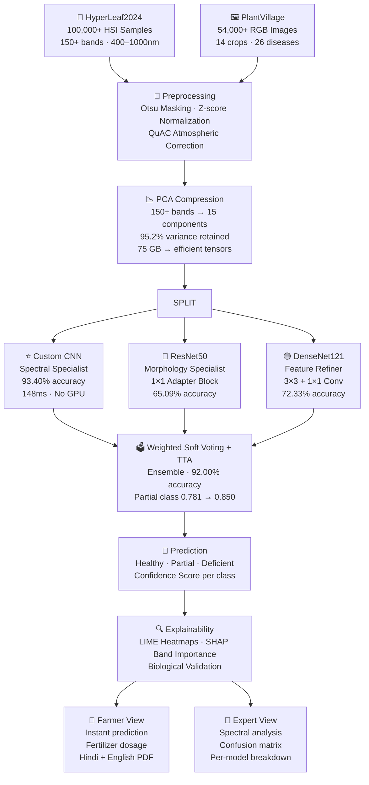

# 🌿 Early and Accurate Nutrient Deficiency Detection in Crops
### Using Hyperspectral Image Analysis and Ensemble Deep Learning

<p align="center">
  
  
  
  
  
  
</p>

<p align="center">
  <b>📄 Published Research Paper</b> — Vridhi Jain, Mitanshi, Mansha<br/>
  Department of Information Technology, Bharati Vidyapeeth's College of Engineering, New Delhi<br/>
  Affiliated to Guru Gobind Singh Indraprastha University, Delhi
</p>

> **An AI-driven, hardware-free system that detects Nitrogen (N), Phosphorus (P), and Potassium (K) deficiencies in crops 10–15 days before visible symptoms appear — using Hyperspectral Imaging and an Ensemble of Deep Learning models. No lab. No GPU. No expensive sensors.**

---

## 📌 Overview

This project presents a **software-driven framework** for early detection of crop nutrient deficiencies using **Hyperspectral Imaging (HSI)** and an **Ensemble of Deep Learning models**, without requiring expensive hardware or lab equipment.

Unlike standard RGB imaging that captures only 3 color channels, HSI records reflected light across **150+ narrow spectral bands (400–1000 nm)**, enabling detection of physiological changes at the cellular level — such as chlorophyll and water content variations — **before symptoms are visible to the naked eye.**

The system achieves **93.40% accuracy** (Custom CNN) and **92% ensemble accuracy**, with an inference time of just **148 ms on CPU** — deployable in remote farming environments without GPU.

---

## ❓ Problem Statement

Nutrient deficiencies drain **nearly 2 out of every 5 crop yields globally** every year (FAO). Yet current detection methods are:

- 🔬 **Too slow** — soil samples and lab tests take days to weeks
- 💸 **Too expensive** — manual inspection requires labor and equipment
- ⏰ **Too late** — visible symptoms appear only after serious plant damage has already occurred
- 🌍 **Not scalable** — existing hyperspectral solutions require costly hardware

**This project solves all four problems** — detecting deficiencies **10–15 days early**, running on **commodity CPUs**, requiring **no physical sensors**, and accessible to **140M+ farmers** via a bilingual (English + Hindi) Streamlit app.

---

## 💥 Impact & Key Numbers

<table>
  <tr>
    <td align="center"><b>🎯 93.40%</b><br/>Custom CNN Accuracy<br/>(Best Individual Model)</td>
    <td align="center"><b>🗳️ 92.00%</b><br/>Ensemble + TTA Accuracy<br/>(Most Stable)</td>
    <td align="center"><b>⚡ 148 ms</b><br/>Inference Time on CPU<br/>(No GPU needed)</td>
  </tr>
  <tr>
    <td align="center"><b>📊 154,000+</b><br/>Training Samples<br/>(HSI + RGB combined)</td>
    <td align="center"><b>🌱 10–15 Days</b><br/>Earlier Detection<br/>vs traditional NDVI</td>
    <td align="center"><b>👨‍🌾 140M+</b><br/>Farmers Targetted<br/>India's Digital Agriculture</td>
  </tr>
  <tr>
    <td align="center"><b>📉 20–40%</b><br/>Potential Crop Loss<br/>Reduction (FAO)</td>
    <td align="center"><b>📐 95.2%</b><br/>Variance Retained<br/>after PCA (150→15 bands)</td>
    <td align="center"><b>🗣️ Bilingual</b><br/>English + Hindi<br/>Interface</td>
  </tr>
</table>

---

## 🎯 Key Results — Model Comparison

| Model | Accuracy | F1-Score | Precision | Recall | ROC-AUC |
|-------|----------|----------|-----------|--------|---------|
| ResNet50 | 65.09% | 45.1% | 64.2% | 47.6% | 0.79 |
| DenseNet121 | 72.33% | 50.7% | 72.7% | 49.8% | 0.83 |
| **Custom CNN ⭐** | **93.40%** | **95.8%** | **89.5%** | **89.5%** | **0.97** |
| Ensemble + TTA | 92.00% | 84.6% | 89.9% | 81.8% | 0.95 |

### Per-Class Performance (Custom CNN — Best Model)

| Class | F1-Score | Notes |
|-------|----------|-------|
| Healthy | 0.958 | Highest confidence |
| Partial Deficiency | 0.781 | Hardest class — subtle early-stage signals |
| Deficient | 0.946 | Strong detection |

> **Ensemble improvement:** Partial class precision improved from 0.781 → **0.850** with Weighted Soft Voting + TTA

---

## 🔬 SHAP Explainability — Spectral Band Importance

| Wavelength | Nutrient Signal | SHAP Score |
|------------|----------------|------------|
| **680 nm** | Chlorophyll absorption — Iron deficiency marker | **0.22** |
| **550–700 nm** | Red-edge region — Nitrogen depletion | **0.18** |
| **1400 nm** | Water absorption — Phosphorus stress indicator | — |

> LIME heatmaps confirm the model attends to **biologically meaningful spectral regions**, not random noise — critical for research validity.

---

## 🏗️ System Architecture & Pipeline



---

## 🧠 Model Architecture Details

### 1. ⭐ Custom CNN — Spectral Specialist (Best Model · 93.40%)

The lightweight residual CNN designed specifically for 15-channel hyperspectral data.

```
Input: 128×128×15 (PCA-compressed hyperspectral patches)
    ↓
Conv2D (32 filters) + BatchNorm + ReLU
    ↓
Conv2D (64 filters) + BatchNorm + ReLU
    ↓
Conv2D (128 filters) + BatchNorm + ReLU + Residual Shortcut ←┐
    ↓                                                          │
MaxPooling2D                                                   │
    ↓                                              (Residual connection
Dropout (p=0.5)                                   prevents overfitting)
    ↓
Dense → Softmax
    ↓
Output: Healthy (0.0) · Partial (0.5) · Deficient (1.0)

Optimizer: Adam (η = 0.0001) · Gradient Clipping (Clipnorm = 1.0)
```

**Why it's the best:** Residual connections allow smooth gradient flow. Gradient clipping prevents loss explosion. Specifically designed for spectral-spatial patterns — not adapted from RGB models.

---

### 2. 🔵 ResNet50 — Morphology Specialist (65.09%)

```
15-channel HSI Input (128×128×15)
    ↓
1×1 Adapter Block (converts 15 → 3 channels)
+ BatchNormalization
    ↓
ResNet50 Base (pretrained ImageNet weights, fine-tuned)
    ↓
Dense 255 → Dropout 0.5 → Output Dense (3 classes)
    ↓
float mapping: 0.0 Healthy · 0.5 Partial · 1.0 Deficient
```

**Limitation:** Failed completely on Partial class (F1 = 0.000) — relying only on morphology misses subtle spectral signals at early stages.

---

### 3. 🟢 DenseNet121 — Feature Refiner (72.33%)

```
15-channel HSI Input (128×128×15)
    ↓
Feature Refiner Block
  ├── 3×3 Conv 32 + BatchNormalization
  └── 1×1 Conv 3 → 3-channel representation (128×128×3)
    ↓
DenseNet121 Base (Trainable: False · ImageNet Weights)
Dense connections preserve fine spectral details
    ↓
Dense 1024 → Dropout 0.5 → Dense 512 → Softmax
    ↓
Output: Healthy · Partial · Deficient
```

**Limitation:** Like ResNet50, struggled with Partial class (F1 = 0.000). Dense connections help but cannot compensate for missing spectral specialization.

---

### 4. 🗳️ Ensemble + TTA — Weighted Soft Voting (92.00%)

The ensemble combines all three models using **Weighted Soft Voting (WSV)**:

```
P_ensemble(k) = (1 / Σwm) × Σ [wm × Pm(k)]

Weights (Performance-based Softmax):
  Custom CNN  → 45.0% weight
  DenseNet121 → 29.5% weight  
  ResNet50    → 25.5% weight

Test-Time Augmentation (TTA):
  Prediction variance: σ = 0.07 → σ = 0.03 (stabilized)
  Partial class precision: 0.781 → 0.850
```

**Why WSV beats hard voting:** Hard voting fails when multiple models predict "Healthy" with low confidence but one model detects deficiency with high confidence. WSV weighs probabilities — stronger predictions outweigh weaker ones.

---

## 📦 Dataset

| Dataset | Type | Samples | Details |
|---------|------|---------|---------|
| **HyperLeaf2024** | Hyperspectral | 100,000+ | 400–1000 nm · 150+ bands · drone + handheld · ~75 GB |
| **PlantVillage** | RGB | 54,000+ | 14 crop types · 26 disease conditions · 256×256 · 38 countries |

**Data Split:** 70% train / 15% validation / 15% test (stratified sampling)

**Augmentation:** Rotation · Flip · Brightness variation · Gaussian blur → dataset diversity 3× increase

---

## 📁 File Structure

```
📦 EANDD/
│
├── 📁 data/
│   ├── 📁 plantvillage/          ← RGB images (54,000+)
│   ├── 📁 hyperleaf2024/         ← Hyperspectral samples (100,000+)
│   └── 📁 preprocessed/          ← PCA-compressed outputs
│
├── 📁 models/
│   ├── 🐍 custom_cnn.py          ← ⭐ Best model · 93.40% accuracy
│   ├── 🐍 resnet50_adapter.py    ← ResNet50 with 1×1 adapter block
│   ├── 🐍 densenet121_refiner.py ← DenseNet121 with feature refiner
│   └── 🐍 ensemble.py            ← Weighted Soft Voting + TTA
│
├── 📁 preprocessing/
│   ├── 🐍 pca_compression.py     ← 15-component PCA pipeline
│   ├── 🐍 normalization.py       ← Z-score normalization
│   ├── 🐍 augmentation.py        ← Rotation, flip, blur, brightness
│   └── 🐍 fusion.py              ← HSI + RGB multimodal fusion (SIFT)
│
├── 📁 explainability/
│   ├── 🐍 lime_analysis.py       ← LIME heatmaps per class
│   └── 🐍 shap_bands.py          ← Global PCA band importance
│
├── 📁 app/
│   ├── 🐍 streamlit_app.py       ← Main Streamlit dashboard
│   ├── 🐍 farmer_view.py         ← Bilingual farmer interface (EN+HI)
│   ├── 🐍 expert_view.py         ← Detailed researcher interface
│   └── 🐍 report_generator.py    ← Auto PDF reports (ReportLab)
│
├── 📁 results/
│   ├── 🖼️ confusion_matrix.png
│   ├── 🖼️ bar_accuracy.png
│   ├── 🖼️ per_class_metrics.png
│   └── 📁 lime_explanations/
│
├── 📄 requirements.txt
└── 📄 README.md                  ← You are here
```

---

## 🖥️ Streamlit Dashboard — Dual Interface

The app features a **dual-interface design** tailored to two very different users:

### 🌾 Farmer View
- Upload leaf image → **instant prediction** (148 ms)
- Fertilizer recommendation — e.g., *"Apply 50 kg/hectare urea"*
- Auto-generated **PDF report** (ReportLab)
- Full **English + Hindi** support
- Designed for non-technical users — **9/10 users navigate without help**

### 🔬 Expert / Researcher View
- Detailed spectral band analysis
- **LIME heatmaps** per class (supporting vs opposing regions)
- **SHAP PCA band importance** charts (PC2, PC5 → 680 nm chlorophyll)
- Per-class confidence breakdown
- Confusion matrix + per-model comparison table

---

## 🔍 Explainability — LIME + SHAP

This project uses **LIME** and **SHAP** to ensure biological validity — confirming the model attends to real plant physiology, not random image artifacts.

**LIME Dashboard outputs:**
- Pseudo-RGB hyperspectral input
- Supporting regions (green) vs opposing regions (red)
- Overlaid importance heatmap with zone scores
- Ensemble confidence scores across all 3 classes
- Per-class LIME region scores (R1–R20)
- Global PCA band importance chart

**Key SHAP findings:**
- **PC2, PC5** pull strongly against "Deficient" classification
- Reflects **680 nm** wavelength — where chlorophyll absorbs light
- Model learns same spectral signals plant scientists use → biologically valid

---

## 🌍 Real-World Impact

| Impact Area | Detail |
|-------------|--------|
| 🇮🇳 India's Digital Agriculture Mission | Directly aligned with national precision farming goals |
| 👨‍🌾 140M+ farmers | Accessible without technical knowledge via bilingual app |
| 📉 20–40% crop loss reduction | Based on FAO global nutrient deficiency loss estimates |
| ⏱️ 10–15 days early warning | Detects before visible symptoms via red-edge shift (715→695 nm) |
| 💻 No GPU, no lab, no sensors | Runs on commodity CPUs · offline capable via TorchScript |
| 🌐 38 countries dataset | PlantVillage covers diverse global agricultural conditions |

---

## 🚀 Installation & Usage

```bash
# Clone the repository
git clone https://github.com/Jainvridhi/Early-and-Accurate-Nutrient-Deficiency-Detection-in-Crops-Using-Hyperspectral-Image-Analysis.git
cd EANDD

# Create virtual environment
python -m venv venv
source venv/bin/activate        # Linux/Mac
venv\Scripts\activate           # Windows

# Install dependencies
pip install -r requirements.txt
```

### Run the Streamlit App
```bash
streamlit run app/streamlit_app.py
```

### Train Models
```bash
# Train Custom CNN (best model)
python models/custom_cnn.py --epochs 50 --batch_size 32

# Train full ensemble
python models/ensemble.py --mode train
```

### Run Inference
```bash
python models/ensemble.py --mode predict --input your_image.npy
```

### Generate LIME Explanations
```bash
python explainability/lime_analysis.py --image your_image.npy
```

---

## 📋 Requirements

```
tensorflow>=2.10.0    torch>=1.13.0         torchvision>=0.14.0
scikit-learn>=1.1.0   numpy>=1.23.0         pandas>=1.5.0
opencv-python>=4.6.0  streamlit>=1.15.0     lime>=0.2.0
shap>=0.41.0          dask>=2022.10.0       reportlab>=3.6.0
matplotlib>=3.6.0     seaborn>=0.12.0       Pillow>=9.3.0
joblib>=1.2.0
```

---

## 🛠️ Tech Stack

`Python` · `TensorFlow` · `PyTorch` · `Scikit-learn` · `OpenCV` · `Dask` · `Streamlit` · `LIME` · `SHAP` · `ReportLab` · `TorchScript`

---

## 📄 Research Paper

> **Early and Accurate Nutrient Deficiency Detection in Crops Using Hyperspectral Image Analysis and Ensemble Deep Learning**
>
> *Vridhi Jain, Mitanshi, Mansha*
> Department of Information Technology, Bharati Vidyapeeth's College of Engineering, New Delhi
> Affiliated to Guru Gobind Singh Indraprastha University, Delhi · 2025

```bibtex
@article{jain2025eandd,
  title   = {Early and Accurate Nutrient Deficiency Detection in Crops
             Using Hyperspectral Image Analysis and Ensemble Deep Learning},
  author  = {Jain, Vridhi and Mitanshi and Mansha},
  journal = {Bharati Vidyapeeth's College of Engineering},
  year    = {2026}
}
```

---

## 🙏 Acknowledgements

- **Dr. Alka Leeka** — Project Supervisor
- **HyperLeaf2024** Dataset Contributors
- **PlantVillage** Dataset — Penn State University
- **Food and Agriculture Organization (FAO)** — crop loss statistics

---

## 👩‍💻 Authors

**Vridhi Jain** — [GitHub](https://github.com/Jainvridhi) · [LinkedIn](https://linkedin.com/in/vridhi-jain-890a9b293)
**Mitanshi** · **Mansha**

Department of Information Technology
Bharati Vidyapeeth's College of Engineering, New Delhi

---

<p align="center">
  <i>⭐ If this research helped you, please consider giving it a star!</i><br/>
  <i>🌱 Built to help 140M+ farmers detect crop deficiencies before it's too late.</i>
</p>
